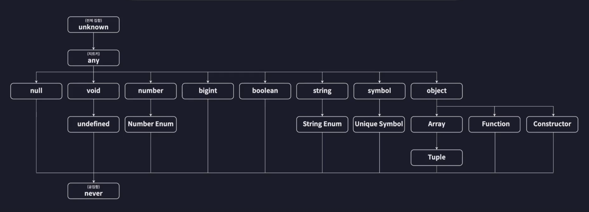

# 타입스크립트 기본

## 타입스크킙트 초기 세팅

- `npm init`

- `sudo npm install -g typescript`

- `npm i @type/node`

- `tsconfig.json` 파일 만들어 설정

  ```json
  {
    "compilerOptions": {
      "target": "ESNext", // 변환되는 JS의 버전 설정
      "module": "ESNext", // 변환되는 JS의 모듈 설정
      "outDir": "dist", // 컴파일러 결과 생성된 JS 파일의 저장 위치 설정
      "strict": true, // 엄격한 타입 검사 모드 설정
      "moduleDetection": "force" // 각 파일을 독립된 모듈로 인식
    },
    "include": ["src"] // 컴파일 범위 설정
  }
  ```

- `tsc` 명령어를 통해 ts 파일이 잘 컴파일 되는지 확인

<br/>

## 기본 타입

- TS가 자체적으로 제공하는 타입, 내장 타입이라고도 부름

- 타입스크립트가 기본적으로 제공하는 타입

    

<br/>

- number

  ```ts
  // number
  let num1: number = 123;
  let num2: number = -123;
  let num3: number = 0.123;
  let num4: number = -0.123;
  let num5: number = Infinity;
  let num6: number = -Infinity;
  let num7: number = NaN;
  // num1 = "hello";
  // num1.toUpperCase();
  num1.toFixed();
  ```

- string

  ```ts
  // string
  let str1: string = "hello";
  let str2: string = `hello ${num1}`;
  // str1.toFixed();
  str1.toUpperCase();
  ```

- boolean

  ```ts
  // boolean
  let bool1: boolean = true;
  let bool2: boolean = false;
  ```

- null, undefined

  ```ts
  // null
  let null1: null = null;
  ```

  ```ts
  // undefined
  let unde1: undefined = undefined;
  ```

- null에 대한 엄격한 모드를 풀어 숫자 변수에 초기값으로 null값 할당하기

  ```json
  {
    "compilerOptions": {
      "target": "ESNext",
      "module": "ESNext",
      "outDir": "dist",
      "strict": true,
      "strictNullChecks": false, // 엄격한 null 검사
      "moduleDetection": "force"
    },
    "include": ["src"]
  }
  ```

  ```ts
  // strictNullChecks
  let numA: number = null;
  ```

- 리터럴 타입

  ```ts
  // 리터럴 타입
  let numB: 10 = 10;
  // numB = 12;
  let strA: "hello" = "hello";
  let boolA: true = true;
  ```

<br/><br/>

### 원시 타입

- 하나의 값만 저장하는 타입, Primitive Type

- number, string, boolean, null, undefined

- 타입 주석 (Type Annotation): 콜론과 함께 어떤 변수의 타입을 명시해주는 코드 부분

<br/><br/>
