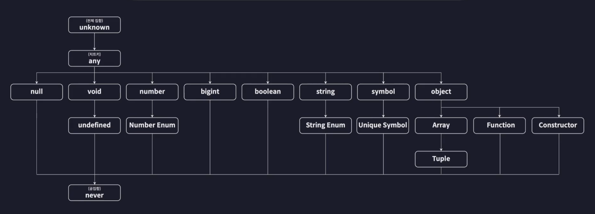

# 타입스크립트 이해하기

## 타입스크립트를 이해한다는 것은?

- 어떤 기준으로 타입을 정의하는지

- 어떤 기준으로 타입간의 관계를 정의하는지

- 어떤 기준으로 타입의 오류를 검사하는지

- 타입스크립트의 구체적인 원리와 동작 방식을 낱낱이 살펴보는 것

<br/>

- 타입스크립트는 문법만 달달 외운다고 실무에 바로 적용할 수 있는 만만한 언어가 아니다.

- 원리와 개념의 뒷받침이 없으면 낯선 상황 앞에서 문제를 해결해나갈 수 없다.

- 따라서 한 번 배울 때 제대로 배워서 JS를 사용했을 때보다 더 안정적이고 좋은 코드를 만들어낼 수 있어야 한다.

<br/><br/>

## 타입은 집합이다

- TS가 말하는 '타입'은 **집합**이다.

- 동일한 속성과 특징을 갖는 여러 개의 값들을 모아둔 집합이다.

- 그리고 예를 들어, number literal Type 집합은 Number Type 집합의 부분 집합이다.

  - 더 큰 타입을 슈퍼 타입(부모 타입), 더 작은 타입을 서브 타입(자식 타입)이라 부른다.

- 이렇듯 TS는 타입들이 서로 집합이고 계층을 이룬다.

<br/>

### 타입 호환성

- 어떤 타입을 다른 타입으로 취급해도 괜찮은 지 판단하는 것을 말한다.

- 예를 들어, Number 리터럴 타입을 Number 타입으로 취급하는 것은 가능하지만, 그 역은 안 된다.

  ```tsx
  let num1: number = 10;
  let num2: 10 = 10;

  num1 = num2; // 가능 - 업 캐스팅
  num2 = num1; // 불가능 (에러) - 다운 캐스팅
  ```

<br/><br/>

## 타입 계층도와 함께 기본타입 살펴보기

- 타입 계층도

    

<br/>

- unknown 타입

  ```tsx
  // unknown 타입
  // 모든 타입의 슈퍼 타입, 전체 집합

  function unknownExam() {
    let a: unknown = 1;
    let b: unknown = "hello";
    let c: unknown = true;
    let d: unknown = null;
    let e: unknown = undefined;
    // 업 캐스팅

    let unknownVar: unknown;

    //   let num: number = unknownVar;
    //   let str: string = unknownVar;
    //   let bool: boolean = unknownVar;
    // 다운 캐스팅 (안됨)
  }
  ```

<br/>

- never 타입

  ```tsx
  // never 타입
  // 모든 타입의 서브 타입
  // 수학의 집합으로 보면 공집합 개념

  function neverExam() {
    function neverFunc(): never {
      while (true) {}
    }

    let num: number = neverFunc();
    let str: string = neverFunc();
    let bool: boolean = neverFunc();
    // 업 캐스팅

    //   let never1: never = 10;
    //   let never2: never = "hello";
    //   let never3: never = true;
    // 다운 캐스팅 (에러)
  }
  ```

<br/>

- void 타입

  ```tsx
  // vold 타입
  // void는 undefined의 슈퍼 타입

  function voidExam() {
    function voidFunc(): void {
      console.log("hi");
    }

    let voidVar: void = undefined; // 업 캐스팅

    function voidFunc2(): void {
      console.log("hello");
      return undefined;
    } // 반환값도 업 캐스팅
  }
  ```

<br/>

- any 타입

  ```tsx
  // any 타입
  // 치트키 타입, 타입 계층도를 완벽히 무시
  // 모든 타입의 슈퍼 타입이자, 모든 타입의 서브 타입이기도 함 (never만 예외)

  function anyExam() {
    let unknownVar: unknown;
    let anyVar: any;

    anyVar = unknownVar; // 다운 캐스팅이 가능

    let undefinedVar: undefined;
    undefinedVar = anyVar; // 다운 캐스팅이 가능

    let neverVar: never;
    // neverVar = anyVar; // 네버 타입은 정말 순수한 공집합이므로
    // 네버 타입 변수에는 그 어떤 타입도 다운 캐스팅이 불가능
  }
  ```

<br/><br/>
